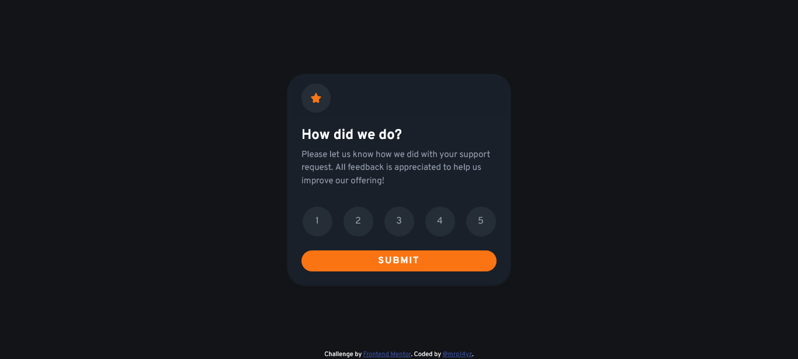
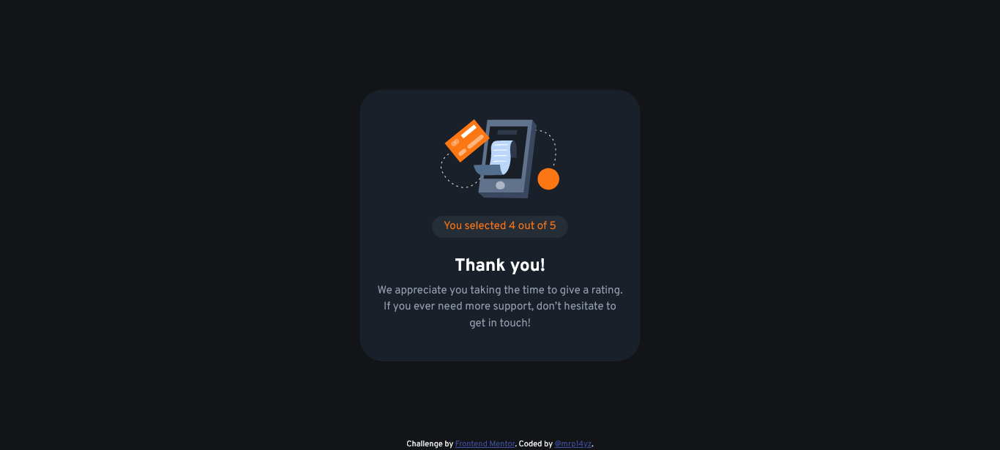

# Frontend Mentor - Interactive rating component solution

This is a solution to the [Interactive rating component challenge on Frontend Mentor](https://www.frontendmentor.io/challenges/interactive-rating-component-koxpeBUmI). Frontend Mentor challenges help you improve your coding skills by building realistic projects. 

## Table of contents

- [Overview](#overview)
  - [The challenge](#the-challenge)
  - [Screenshot](#screenshot)
  - [Links](#links)
- [My process](#my-process)
  - [Built with](#built-with)
  - [What I learned](#what-i-learned)
  - [Continued development](#continued-development)
  - [Useful resources](#useful-resources)
- [Author](#author)

## Overview

### The challenge

Users should be able to:

- View the optimal layout for the app depending on their device's screen size
- See hover states for all interactive elements on the page
- Select and submit a number rating
- See the "Thank you" card state after submitting a rating

### Screenshot




### Links

- Solution URL: [Solution URL here](https://github.com/mrp14yz/ratingcomponentchallange)
- Live Site URL: [Live site URL here](https://mrp14yz.github.io/)

## My process

### Built with

- Semantic HTML5 markup
- CSS custom properties
- [Bootstrap](https://getbootstrap.com/)
- [Vue.js](https://vuejs.org/) - JS framework

### What I learned

```html
<div class="row row-cols-5 g-3 text-center my-3">
  <div class="col"  v-for="(item, index) in new Array(data.length)"
  :key="index"
  >
    <button class="btn btn-secondary rounded-circle" type="button" 
    :class = "{ active: index + 1 === activeButton}" @click="setActive(index)"> {{ index + 1 }}</button>
  </div>
</div>
```
```css
:root{
    --orange: hsl(25, 97%, 53%);
    --white: hsl(0, 0%, 100%);
    --light-grey: hsl(217, 12%, 63%);
    --medium-grey: hsl(216, 12%, 54%);
    --dark-blue: hsl(213, 19%, 18%);
    --very-dark-blue: hsl(216, 12%, 8%);
}
```
```js
Vue.createApp({
    data() {
      return {
        data: [ 1, 2, 3, 4, 5],
        activeButton: null,
        isSubmit: false,
      }
    },
    methods: {
        setActive(index){
            this.activeButton = index + 1;
        },
        submit(activeButton){
            if(activeButton)
                this.isSubmit = true;
        }
    }
  }).mount('#card-rating')
```

### Continued development

I would like to learn more about vue.js, and gain more experience using vue.js.

### Useful resources

- [Change button color using Vue.js](https://stackoverflow.com/questions/68561972/how-to-change-button-color-if-button-active-or-selected-using-vue-js) - This helped me a lot, this is the first time i try using Vue.js, i try search how to make event on click using Vue.js. Thanks to this, it's a lot easier to understand.
- [How to toggle active class inside v-for](https://medium.com/js-dojo/how-to-toggle-active-class-inside-v-for-2849dc54c40c) - This is an amazing article which helped me finally understand how to using v-for for looping button for rating in challange.

## Author

- Frontend Mentor - [@mrp14yz](https://www.frontendmentor.io/profile/mrp14yz)